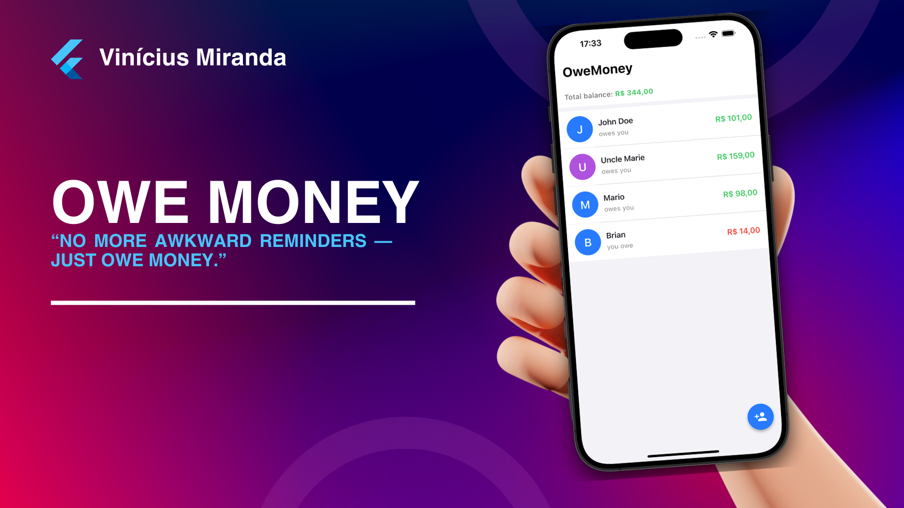
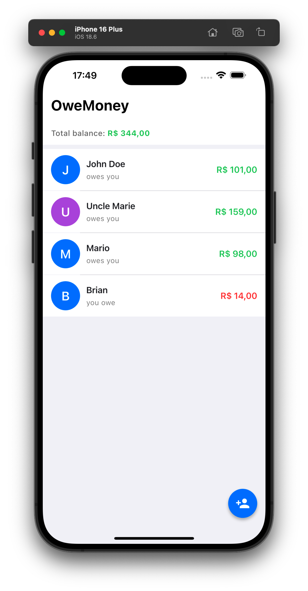
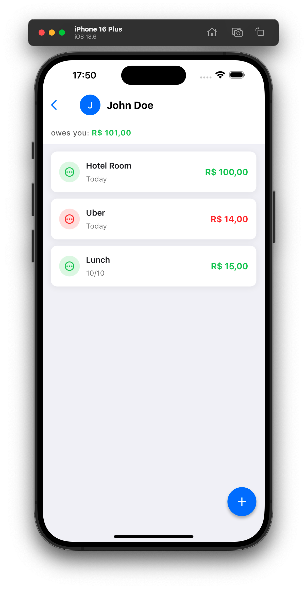

# OweMoney 💰

Track who owes you money and who you owe money to with style.

A beautifully crafted Flutter app featuring a WhatsApp-style interface for managing debts and loans with friends, family, and colleagues. Built with local database persistence using Drift (SQLite).
   
 

## Features ✨

- **WhatsApp-Style Interface**: Clean, familiar interface for browsing your contacts
- **Bidirectional Tracking**: Track both money owed to you (green) and money you owe (red)
- **Debt Management**: Add, view, and mark debts as paid with smooth swipe gestures
- **Local Database**: All data stored securely on your device using Drift/SQLite
- **Real-time Updates**: Automatic UI updates when data changes
- **Apple Design Language**: Follows Human Interface Guidelines with:
  - Clean typography and spacing (8px grid system)
  - Spring animations (elastic curves)
  - Color-coded amounts (iOS green/red/gray)
  - Smooth transitions and gestures
  - Proper contrast and accessibility

## Screenshots 📱

The app features two main screens:

1. **Home Screen**: List of people with total amounts owed
   - Color-coded avatars with initials
   - Total balance at the top
   - Green for money owed to you, red for money you owe
   - Floating action button to add new people

 


2. **Details Screen**: List of debts for each person
   - Individual debt cards with title, amount, and date
   - Swipe to mark as paid/unpaid
   - Visual distinction for paid debts (reduced opacity)
   - Floating action button to add new debts

 

## Tech Stack 🛠

- **Flutter**: Cross-platform mobile framework
- **Drift**: Type-safe, reactive persistence library (SQLite)
- **Material 3**: Modern design system
- **intl**: Internationalization and currency formatting

## Database Structure 📊

### Tables

**People**
- `id`: Primary key (auto-increment)
- `name`: Person's name (1-100 characters)
- `createdAt`: Timestamp of creation

**Debts**
- `id`: Primary key (auto-increment)
- `personId`: Foreign key to People (cascade delete)
- `title`: Description of the debt (1-200 characters)
- `amount`: Monetary value (positive = they owe you, negative = you owe them)
- `date`: Date the debt was incurred
- `isPaid`: Payment status (default: false)
- `createdAt`: Timestamp of creation

## Project Structure 📁

```
lib/
├── main.dart                           # App entry point and theme configuration
├── database/
│   ├── database.dart                   # Drift database definition
│   └── database.g.dart                 # Generated Drift code
├── pages/
│   ├── home_page.dart                  # Main screen with people list
│   └── owe_page.dart                   # Detail screen with debts list
├── widgets/
│   ├── add_person_dialog.dart          # Dialog for adding new people
│   ├── add_debt_bottom_sheet.dart      # Bottom sheet for adding debts
│   ├── person_tile.dart                # Reusable person list tile
│   └── debt_card.dart                  # Reusable debt card with swipe actions
└── utils/
    ├── currency_formatter.dart         # Currency formatting utilities (R$)
    └── date_formatter.dart             # Date formatting utilities (pt_BR)
```

## Getting Started 🚀

### Prerequisites

- Flutter SDK (≥3.9.0)
- Dart SDK
- Android Studio / Xcode (for mobile development)

### Installation

1. Clone the repository:
```bash
git clone <your-repo-url>
cd owemoney
```

2. Install dependencies:
```bash
flutter pub get
```

3. Generate Drift code:
```bash
dart run build_runner build --delete-conflicting-outputs
```

4. Run the app:
```bash
flutter run
```

## Usage 📖

### Adding a Person

1. Tap the floating action button (person icon) on the home screen
2. Enter the person's name
3. Tap "Add"

### Adding a Debt

1. Tap on a person from the list
2. Tap the floating action button (plus icon) on the detail screen
3. Fill in:
   - **Title**: Description of the debt (e.g., "Lunch", "Loan")
   - **Amount**: Monetary value
   - **Date**: When the debt was incurred (defaults to today)
   - **Direction**: Select whether they owe you or you owe them
4. Tap "Add Debt"

### Marking Debts as Paid

- **Swipe left or right** on any debt card to toggle its paid status
- **Tap** on a debt card for quick toggle
- Paid debts appear with reduced opacity and strikethrough text

## Design Philosophy 🎨

This app follows **Apple's Human Interface Guidelines**:

- **Clarity**: Text is legible, icons are precise, adornments are subtle
- **Deference**: Content fills the screen while UI elements defer to it
- **Depth**: Visual layers and realistic motion convey hierarchy

### Color Palette

- **iOS Blue** (`#007AFF`): Primary actions and highlights
- **iOS Green** (`#34C759`): Positive amounts (money owed to you)
- **iOS Red** (`#FF3B30`): Negative amounts (money you owe)
- **iOS Gray** (`#8E8E93`): Neutral/zero amounts
- **Background** (`#F2F2F7`): iOS-style light background

### Typography

- **San Francisco Pro** inspired (system default on iOS)
- Tight letter spacing (-0.4 to -0.6) for modern look
- Bold weights (600-700) for hierarchy
- Font sizes: 14-28pt for optimal readability

## Development Notes 🔧

### Code Generation

When you modify the database schema in `lib/database/database.dart`, regenerate the code:

```bash
dart run build_runner build --delete-conflicting-outputs
```

Or watch for changes during development:

```bash
dart run build_runner watch --delete-conflicting-outputs
```

### Comments

The codebase includes extensive comments explaining:
- Class and function purposes
- Implementation details
- Design decisions
- Usage examples

## License

This project is a personal app for tracking debts. Feel free to use and modify as needed.
